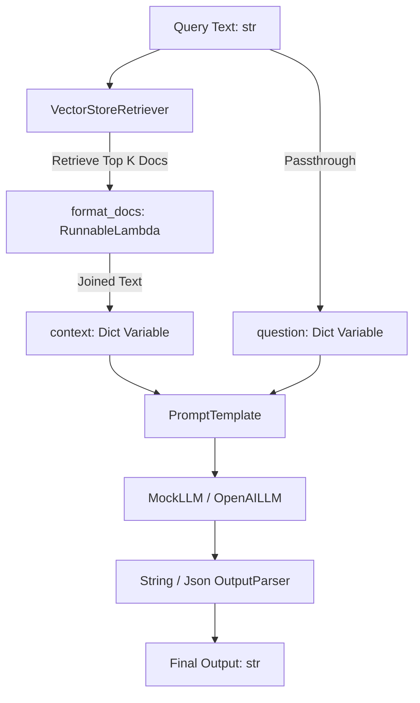

# Lite-LCEL ⚡

<p align="center">
  
  
  
  
</p>

`lite-lcel` is a high-performance, modular, and educational Python library that implements the core mechanics of **LangChain Expression Language (LCEL)** from the ground up. By overloading Python's pipe (`|`) operator, it enables developer-friendly chaining of prompts, LLMs, memory, and output parsers.

Designed with **zero external core dependencies** (not even requiring numpy or scipy), it provides clean, pure-Python implementations of advanced features such as **asynchronous execution**, **real-time streaming**, **parallel execution**, **dynamic routing**, **exponential backoff retries**, **conversational memory**, **autonomous tool-calling agents (`AgentExecutor`)**, and **RAG pipelines**.

---

## 🏗️ RAG Architecture & Data Flow

With zero external vector database dependencies, `lite-lcel` implements a TF-based local cosine similarity algorithm. The search step (`Retriever`) is a subclass of `Runnable` and integrates natively into LCEL pipelines:



---

## ✨ Features

- **🔗 LCEL Chaining (`|` & `__or__`):** Connect prompt templates, LLMs, parsers, and custom functions with native pipe overloading.
- **🔍 Native RAG & Vector Search:** Zero-dependency `InMemoryVectorStore` using pure-Python cosine similarity matching (`_cosine_similarity`) and a chain-compatible `VectorStoreRetriever`.
- **🤖 Autonomous ReAct Agents (`AgentExecutor`):** Implement multi-step decision loops where models autonomously invoke Python tools until reaching a final natural language answer.
- **🔄 Auto-Retry with Backoff (`RunnableRetry`):** Automatically retry unstable API calls using exponential backoff (e.g., `.with_retry(attempts=3, backoff_factor=1.0)`).
- **🧠 Conversational Memory (`RunnableWithMessageHistory`):** Session-aware chat logging that automatically manages system/user message logs and formats templates.
- **🛠️ Decorator-Driven Tools:** Transform any Python function into a JSON-schema-compliant tool with a simple `@tool` decorator.
- **🌊 Real-Time Streaming:** Stream token-by-token responses using `stream` and `astream` generators.
- **⚡ Asynchronous Execution:** High-performance, non-blocking operations with `ainvoke` and `abatch`.
- **🔀 Parallel Chains (`RunnableParallel`):** Execute multiple independent pipeline branches concurrently using Python `ThreadPoolExecutor`.
- **🌿 Dynamic Routing (`RunnableBranch`):** Route inputs dynamically to different sub-chains based on conditional checks.
- **🛡️ Fallback Chains (`RunnableWithFallbacks`):** Seamless recovery from API errors by switching to backup models or custom fallback chains.
- **📊 Event Tracing (Callbacks):** Trace pipeline steps, model calls, and latency hooks using the visual `ConsoleCallbackHandler`.
- **📦 JSON Parsing (`JsonOutputParser`):** Clean and parse raw markdown codeblocks from LLMs directly into structured Python dictionaries or lists.

---

## 🛠️ Detailed Component Deep Dive

Here is how the core modules are implemented and how they interact under the hood:

### 1. The `Runnable` Base Class & Pipe Chaining
Every component in the library inherits from `Runnable`. By overriding Python's special methods `__or__` and `__ror__`, we compile sequential execution chains (`RunnableSequence`) and parallel branches (`RunnableParallel`). 
```python
# Pipe overloading compilation
def __or__(self, other):
    return RunnableSequence(self, coerce_to_runnable(other))
```
Any standard Python dictionary passed to a chain is automatically coerced into a `RunnableParallel` object, enabling parallel data processing. Callable functions are wrapped in `RunnableLambda` objects.

### 2. Local Vektör Veritabanı (RAG & Cosine Similarity)
To remain completely dependency-free, `lite-lcel` parses raw texts into word frequency counters. It computes the **Cosine Similarity** between query vectors and document vectors using standard library mathematical functions:
$$\text{Cosine Similarity} = \frac{\mathbf{A} \cdot \mathbf{B}}{\|\mathbf{A}\| \|\mathbf{B}\|}$$
```python
# Pure Python Cosine Similarity Calculation
dot_product = sum(vec1[x] * vec2[x] for x in intersection)
magnitude = math.sqrt(sum(vec1[x]**2 for x in vec1)) * math.sqrt(sum(vec2[x]**2 for x in vec2))
return dot_product / magnitude
```
The `VectorStoreRetriever` delegates search tasks to a background thread pool inside its asynchronous `_ainvoke` implementation to ensure high-performance, non-blocking asynchronous execution.

### 3. ReAct Autonomous Agent Executor (`AgentExecutor`)
The autonomous agent drives a decision-making loop:
1. Receives human query -> Generates LLM response.
2. If the LLM generates a tool call request (`AIMessage(tool_calls=[...])`), the agent halts model completion, resolves tool parameters, executes the matching Python `@tool` function, and appends the result to message history.
3. If the tool call fails or enters an infinite loop, the agent prevents repeated calls by examining historical execution patterns and enforcing a `max_iterations` ceiling.
4. Once tools are completed, the model synthesizes all inputs/outputs into a natural language response.

### 4. Exponential Backoff Retry Logic (`RunnableRetry`)
When dealing with flaky API calls, the `RunnableRetry` wrapper intercepts exceptions. It calculates delay intervals using an exponential backoff formula:
$$\text{delay} = \text{backoff\_factor} \times 2^{\text{attempt}}$$
This guarantees resilience against rate limits and transient connection dropouts.

---

## 🚀 Installation

Install the package in editable mode with development dependencies:

```bash
# Set up virtual environment, install requirements, and package links
make dev-install
```

Alternatively, run:

```bash
pip install -e .[dev,openai]
```

---

## 🤖 CLI & Interactive Playground

`lite-lcel` includes an interactive playground and runner that lets you run example scripts or test prompt chains live in your terminal:

```bash
# Launch the interactive menu dashboard
.venv/bin/lite-lcel
```

You can also use command-line arguments to launch the REPL playground directly or trigger a specific example:
```bash
# Start an interactive REPL chain with trace logging
.venv/bin/lite-lcel --playground

# Run a specific demo scenario
.venv/bin/lite-lcel --example rag_chain
```

---

## 📖 Executable Demo Scenarios (`examples/`)

The repository contains 10 plug-and-play example scripts demonstrating individual features:

1. **`basic_chain.py`:** Simple string and JSON format parsing pipelines.
2. **`async_chain.py`:** Concurrent, non-blocking chain invocations.
3. **`streaming_chain.py`:** An token-by-token real-time terminal output demo.
4. **`parallel_chain.py`:** Running independent prompt branches concurrently.
5. **`branch_and_fallback.py`:** Conditional routing and failover recovery models.
6. **`stateful_chain.py`:** Conversational memory tracker preserving history.
7. **`tool_calling_chain.py`:** Binding tools and parsing schema metadata.
8. **`autonomous_agent.py`:** Multi-step tool-execution agent loops.
9. **`retry_chain.py`:** Unstable network retries with exponential backoffs.
10. **`rag_chain.py`:** Full document retrieval, injection, and synthesis pipeline.

---

## 🧪 Testing

The codebase includes an extensive suite of 30 unit and integration tests covering concurrency, streaming, routing, and agents.

Run all tests via pytest:
```bash
pytest
```

Or via Makefile:
```bash
make test
```

---

## 📂 Directory Layout

```text
.
├── Makefile                    # Standard developer commands (test, format, lint)
├── pyproject.toml              # Packaging, dependency declarations, and entry points
├── requirements.txt            # Minimal runtime dependencies
├── requirements-dev.txt        # Local testing and formatting libraries
├── README.md                   # Core documentation (English)
├── LICENSE                     # MIT License
├── CONTRIBUTING.md             # Developer workflow and codebase guidelines
├── .github/
│   └── workflows/
│       └── tests.yml           # Automated GitHub Actions test pipeline
├── lite_lcel/                  # Core package source folder
│   ├── py.typed                # PEP 561 marker file for inline type hints
│   ├── base.py                 # Core Runnable pipeline orchestration logic
│   ├── prompts.py              # Prompt templates and Message data models
│   ├── parsers.py              # String and JSON output parsing utilities
│   ├── callbacks.py            # Latency and pipeline step tracing callbacks
│   ├── tools.py                # Type-hint parser & JSON schema converter
│   ├── memory.py               # ChatMessageHistory and stateful session memory
│   ├── agents.py               # ReAct autonomous AgentExecutor loop
│   ├── vectorstores.py         # Document models, vector store, and retriever
│   ├── cli.py                  # CLI Playground & Example selection menu
│   └── models/                 # Model client adapters (Mock, OpenAI)
├── tests/                      # Extensive pytest-asyncio unit test suites
└── examples/                   # 10 executable demo scenarios showing all features
```

---

## 👤 Author

Developed and maintained by **[xaynx](https://github.com/Xaynxofficial)**.
